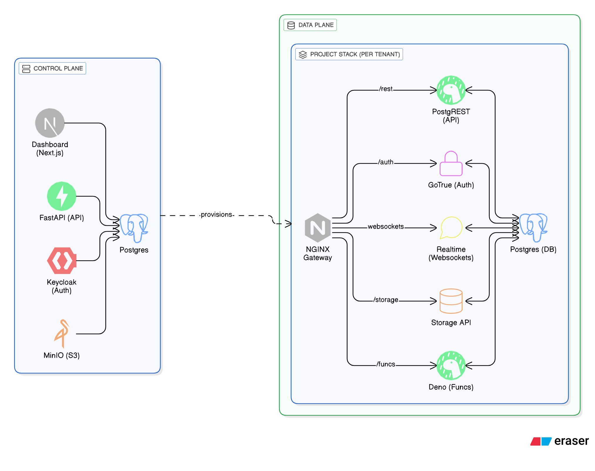

# Supalove 🚀

**The Open-Source Supabase Cloud Clone**

A fully self-hosted, multi-tenant backend-as-a-service platform that provides 100% API compatibility with Supabase Cloud. Deploy your own Supabase infrastructure on any server using Docker or Coolify.

[](./DEPLOY_TO_COOLIFY.md)
[](./LICENSE)

---

## ✨ Features

| Feature | Status | Description |
|---------|--------|-------------|
| **Database** | ✅ | PostgreSQL 15 with Supabase extensions |
| **Auth** | ✅ | GoTrue v2.184 - Magic links, OAuth, JWTs |
| **REST API** | ✅ | PostgREST v12 - Auto-generated from schema |
| **Realtime** | ✅ | Websocket subscriptions to DB changes |
| **Storage** | ✅ | S3-compatible file storage |
| **Edge Functions** | ✅ | Deno TypeScript runtime |
| **Multi-Tenancy** | ✅ | Isolated project stacks per user |
| **Shared Plan** | ✅ | Free tier with shared infrastructure |
| **Dedicated Plan** | ✅ | Premium tier with isolated Docker stack |
| **Dashboard** | ✅ | Next.js 16 management UI |
| **Billing** | ✅ | Stripe integration ready |

---

## 🏗️ Architecture

```
┌─────────────────────────────────────────────────────────────┐
│                     CONTROL PLANE                          │
│  ┌──────────┐  ┌──────────┐  ┌──────────┐  ┌──────────┐   │
│  │Dashboard │  │ FastAPI  │  │Keycloak  │  │  MinIO   │   │
│  │(Next.js) │  │  (API)   │  │ (Auth)   │  │  (S3)    │   │
│  └────┬─────┘  └────┬─────┘  └────┬─────┘  └────┬─────┘   │
│       │             │             │             │          │
│       └─────────────┴─────────────┴─────────────┘          │
│                         │                                   │
│              Control Plane Database (Postgres)              │
└─────────────────────────┬───────────────────────────────────┘
                          │ Provisions
                          ▼
┌─────────────────────────────────────────────────────────────┐
│                      DATA PLANE                             │
│  ┌─────────────────────────────────────────────────────┐   │
│  │              PROJECT STACK (per tenant)              │   │
│  │  ┌────────┐ ┌────────┐ ┌────────┐ ┌────────────┐   │   │
│  │  │Postgres│ │PostgREST│ │GoTrue  │ │  Realtime  │   │   │
│  │  │  (DB)  │ │ (API)  │ │ (Auth) │ │(Websockets)│   │   │
│  │  └────────┘ └────────┘ └────────┘ └────────────┘   │   │
│  │  ┌────────┐ ┌────────┐ ┌───────────────────────┐   │   │
│  │  │Storage │ │  Deno  │ │   NGINX Gateway       │   │   │
│  │  │  API   │ │(Funcs) │ │ Routes: /rest /auth   │   │   │
│  │  └────────┘ └────────┘ └───────────────────────┘   │   │
│  └─────────────────────────────────────────────────────┘   │
└─────────────────────────────────────────────────────────────┘
```


---

## 🚀 Quick Start

### Local Development

```bash
# 1. Clone the repository
git clone https://github.com/farisnoaman/supalove.git
cd supalove

# 2. Start control plane services
docker compose up -d

# 3. Install dashboard dependencies
cd dashboard && npm install

# 4. Start the API
cd ../control-plane/api
python -m venv venv && source venv/bin/activate
pip install -r requirements.txt
uvicorn src.main:app --reload --port 8000

# 5. Start the dashboard
cd ../../dashboard
npm run dev
```

**Access:**
- Dashboard: http://localhost:3000
- API: http://localhost:8000
- API Docs: http://localhost:8000/docs

### Production (Coolify)

See [DEPLOY_TO_COOLIFY.md](./DEPLOY_TO_COOLIFY.md) for one-click deployment.

---

## 📖 Documentation

| Document | Description |
|----------|-------------|
| [Architecture](./docs/ARCHITECTURE.md) | System design and components |
| [Architecture vs Plan](./docs/ARCHITECTURE_VS_PLAN.md) | How app structure changes per plan |
| [Billing System](./docs/BILLING.md) | Plans, entitlements, and Stripe integration |
| [Shared Plan Architecture](./docs/SHARED_PLAN_ARCHITECTURE.md) | Shared vs Dedicated plans |
| [API Reference](./docs/API.md) | REST API endpoints |
| [Deployment Guide](./DEPLOY_TO_COOLIFY.md) | Coolify deployment instructions |
| [CLI Documentation](./CLI_docs.md) | Command-line interface |
| [Roadmap](./ROADMAP.md) | Future development plans |

---

## 🔧 Configuration

### Environment Variables

| Variable | Description | Default |
|----------|-------------|---------|
| `DATABASE_URL` | Control plane DB connection | `postgresql://...` |
| `ALLOWED_ORIGINS` | CORS allowed origins | `localhost:3000` |
| `NEXT_PUBLIC_API_URL` | Dashboard → API URL | `http://localhost:8000` |
| `MINIO_ROOT_USER` | MinIO admin username | `minioadmin` |
| `MINIO_ROOT_PASSWORD` | MinIO admin password | `minioadmin` |

---

## 🔌 API Compatibility

Supalove is **100% compatible** with `@supabase/supabase-js`:

```typescript
import { createClient } from '@supabase/supabase-js'

const supabase = createClient(
  'https://your-project.gateway.yourdomain.com',
  'your-anon-key'
)

// Works exactly like Supabase Cloud!
const { data } = await supabase.from('todos').select('*')
```

---

## 📂 Project Structure

```
supalove/
├── control-plane/          # Platform management
│   ├── api/                # FastAPI backend
│   │   └── src/
│   │       ├── api/v1/     # REST endpoints
│   │       ├── services/   # Business logic
│   │       │   ├── billing_service.py
│   │       │   ├── entitlement_service.py
│   │       │   ├── cluster_service.py
│   │       │   └── usage_service.py
│   │       └── models/     # SQLAlchemy models
│   │           ├── plan.py
│   │           ├── organization_entitlement.py
│   │           ├── cluster.py
│   │           └── cluster_usage.py
│   └── scripts/            # Migration & verification scripts
├── dashboard/              # Next.js 16 frontend
│   └── src/
│       ├── app/            # App Router pages
│       │   └── org/[orgId]/billing/  # Billing UI
│       └── components/     # React components
├── data-plane/             # Project templates
│   ├── project-template/   # Docker Compose stack
│   ├── shared/             # Shared infrastructure
│   └── projects/           # Running project data
├── docker-compose.yml      # Local development
├── docker-compose.coolify.yml  # Production deployment
└── docs/                   # Documentation
```

---

## 🛡️ Security

- **Tenant Isolation**: Each project runs in its own Docker network
- **JWT Authentication**: Industry-standard token-based auth
- **Row-Level Security**: Postgres RLS for data access control
- **HTTPS**: TLS termination via Coolify/Traefik

---

## 🤝 Contributing

Contributions are welcome! Please read our contributing guidelines before submitting PRs.

```bash
# Run tests
cd control-plane/api
pytest

# Lint code
ruff check .
```

---

## 📄 License

MIT License - see [LICENSE](./LICENSE) for details.

---

**Built with ❤️ by the Supalove Team**