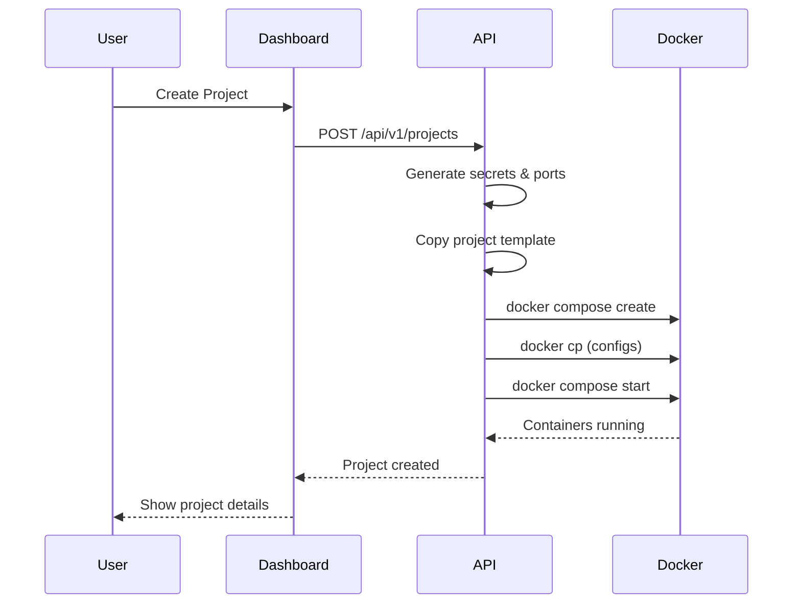

# Supalove Architecture

This document describes the architecture of Supalove, a self-hosted Supabase Cloud clone.

## Overview

Supalove follows a **Control Plane / Data Plane** architecture pattern, similar to Supabase Cloud:

- **Control Plane**: Manages users, organizations, billing, and orchestrates project provisioning
- **Data Plane**: Runs isolated backend stacks (Postgres, Auth, Storage, etc.) for each tenant project

---

## Control Plane Components

### 1. Dashboard (Next.js 16)

The frontend application providing the management UI.

**Location**: `dashboard/`

**Key Features**:
- Project management (create, start, stop, delete)
- Database browser and SQL editor
- Auth user management
- Storage file browser
- Edge function deployment
- Organization and team management
- Billing integration

**Stack**:
- Next.js 16 with App Router
- React 18
- Tailwind CSS
- Lucide React icons

---

### 2. API (FastAPI)

The backend service handling all platform operations.

**Location**: `control-plane/api/`

**Endpoints** (`/api/v1/`):
| Endpoint | Description |
|----------|-------------|
| `/auth` | Platform login/signup |
| `/orgs` | Organization management |
| `/projects` | Project CRUD and lifecycle |
| `/projects/{id}/auth/users` | Project auth user management |
| `/projects/{id}/storage` | File storage operations |
| `/projects/{id}/functions` | Edge function deployment |
| `/projects/{id}/secrets` | Environment variable management |
| `/billing` | Stripe subscription management |

**Key Services**:
- `provisioning_local.py` - Provisions Docker containers via `docker compose`
- `secrets_service.py` - Generates and manages project secrets/ports
- `project_service.py` - Project lifecycle management
- `billing_service.py` - Stripe integration and webhooks
- `entitlement_service.py` - Plan-based quota enforcement
- `cluster_service.py` - Private cluster provisioning
- `usage_service.py` - Resource usage tracking

---

### 3. Control Plane Database (PostgreSQL 15)

Stores platform metadata (not user data).

**Tables**:
- `users` - Platform users
- `organizations` - Multi-tenant orgs
- `org_members` - User-org relationships
- `projects` - Project metadata
- `project_secrets` - Encrypted credentials
- `plans` - Subscription tiers (Free, Pro, Premium)
- `organization_entitlements` - Org plan associations and usage
- `subscriptions` - Active billing subscriptions
- `invoices` - Payment history
- `clusters` - Infrastructure clusters (shared/private)
- `cluster_usage` - Resource consumption tracking

---

### 4. Keycloak (SSO)

Handles platform authentication.

**Port**: 8080
**Admin UI**: `/admin`

*Note: Currently optional; FastAPI handles auth directly via JWT.*

---

### 5. MinIO (S3-Compatible Storage)

Object storage for platform assets.

**Ports**:
- 9000 - S3 API
- 9001 - Console UI

---

## Data Plane Components

When a user creates a project, Supalove provisions an **isolated Docker stack**:

### Per-Project Services

| Service | Image | Purpose |
|---------|-------|---------|
| **postgres** | `supabase/postgres:15.8.1.085` | Database with Supabase extensions |
| **api** | `postgrest/postgrest:v12.2.3` | Auto-generated REST API |
| **auth** | `supabase/gotrue:v2.184.0` | User auth (JWT, Magic Link, OAuth) |
| **realtime** | `supabase/realtime:v2.68.0` | Websocket subscriptions |
| **storage** | `supabase/storage-api:v1.33.0` | File storage API |
| **functions** | `denoland/deno:latest` | Edge function runtime |
| **gateway** | `nginx:alpine` | Request router |

### Network Isolation

Each project runs in its own Docker network:
```
project_{PROJECT_ID}_net
```

### Port Allocation

Ports are dynamically allocated starting from 5500:
- DB_PORT, REST_PORT, AUTH_PORT, etc.
- Port availability is checked against running Docker containers

---

## Provisioning Flow



### Key Implementation Details

1. **Template Copying**: Project template is baked into the API Docker image
2. **Config Injection**: Uses `docker cp` instead of volume mounts (Docker-in-Docker compatibility)
3. **Port Discovery**: Queries `docker ps` to find available host ports

---

## Deployment Architecture

### Local Development
```
docker-compose.yml → Control Plane services
./start_backend.sh → FastAPI server
npm run dev       → Next.js dashboard
```

### Production (Coolify)
```
docker-compose.coolify.yml → All services
- Builds API from Dockerfile
- Builds Dashboard from Dockerfile
- Pulls official images for Postgres, Keycloak, MinIO
```

---

## Security Model

### Platform Level
- JWT authentication for API access
- CORS whitelisting for trusted origins
- HTTPS termination via reverse proxy

### Project Level
- Isolated Docker networks per project
- Unique JWT secrets per project
- Row-Level Security (RLS) in Postgres
- Separate database credentials per project

---

## Scaling Considerations

| Aspect | Current | Future |
|--------|---------|--------|
| **Projects** | Single server, ~50 projects | Kubernetes / Swarm |
| **Database** | Per-project Postgres | Shared clusters |
| **Compute** | Vertical scaling | Horizontal / Edge |
| **Storage** | MinIO single node | Distributed MinIO |
