# Architecture by Plan

Supalove's architecture adapts based on the user's subscription plan. This ensures cost-efficiency for free users while providing isolation and performance for premium users.

---

## Architecture Strategies

Supalove uses two primary **Cluster Strategies** to provision infrastructure:

1. **Global Shared (`global_shared`)**: Multi-tenant architecture where projects share underlying resources.
2. **Private Per-Org (`private_per_org`)**: Single-tenant architecture where an organization gets dedicated infrastructure.

---

## 1. Free Plan

**Strategy**: `global_shared`

The Free plan allows users to build and prototype without provisioning dedicated resources.

### Project Structure

- **Database**: Logical database (or schema) inside the **Shared Postgres Cluster**.
- **Auth/API**: Requests are routed through a shared API/Auth gateway that handles multi-tenancy.
- **Storage**: Tenant-isolated buckets within the Shared MinIO cluster.
- **Compute**: Shared Deno Edge Functions runtime.

### How it Works

1. User creates a project.
2. **No Docker containers** are spun up for the project.
3. System creates a Postgres logical database `project_{id}` on the shared cluster.
4. Services (PostgREST, GoTrue) are already running and configured to serve multiple tenants dynamically.

### Pros & Cons

- ✅ **Instant Provisioning**: No container startup time.
- ✅ **Low Resource Footprint**: Thousands of idle projects cost minimal RAM.
- ⚠️ **Noisy Neighbors**: Heavy load from one user *could* impact others (mitigated by strict quotas).
- ⚠️ **Shared Maintenance**: Maintenance windows affect all free users.

---

## 2. Pro Plan

**Strategy**: `global_shared` (Same as Free)

The Pro plan offers more resources and capabilities on the same efficient shared architecture.

### Project Structure

*Same as Free Plan*

### Key Differences

- **Higher Quotas**: 
  - Projects: 20 (vs 2)
  - Database: 5GB (vs 500MB)
  - Storage: 50GB (vs 1GB)
- **Priority**: Higher rate limits on the shared API gateway.
- **Backup Retention**: Longer retention period for snapshots.

### Why Shared?

Even for professional side-projects, the overhead of dedicated containers (RAM/CPU) often outweighs the benefits. The Shared architecture provides enterprise-grade performance (because the shared cluster is large) without the startup latency of dedicated stacks.

---

## 3. Premium Plan

**Strategy**: `private_per_org`

The Premium plan provides complete isolation for production-grade workloads.

### Project Structure

Each organization gets a **Dedicated Cluster**, which includes:

- **Dedicated Postgres**: A private Docker container (or VM) running Postgres.
- **Private API/Auth**: Dedicated PostgREST and GoTrue instances.
- **Network Isolation**: Runs in a private Docker network `net_org_{id}`.
- **Dedicated IP** (Optional): Can be configured for whitelist access.

### How it Works

1. User upgrades to Premium or creates a Premium project.
2. `SchedulerService` kicks off an async provisioning job.
3. System provisions a new **Cluster** record.
4. Docker services are spun up specifically for this organization.
5. Projects created within this org are assigned to this private cluster.

### Pros & Cons

- ✅ **Full Isolation**: Zero noisy neighbor risk.
- ✅ **Custom Config**: Can tune Postgres/API parameters explicitly.
- ✅ **Security**: Physical data separation (separate data volume).
- ⚠️ **Slower Provisioning**: Containers take seconds/minutes to start.
- ⚠️ **Higher Cost**: Dedicated resources consume baseline RAM/CPU even when idle.

---

## Summary Comparison

| Plan        | Architecture Strategy | Database                | API/Auth Service       | Storage              | Provisioning Time |
| ----------- | --------------------- | ----------------------- | ---------------------- | -------------------- | ----------------- |
| **Free**    | Global Shared         | Shared Cluster (Schema) | Shared Gateway         | Shared MinIO         | Instant (<1s)     |
| **Pro**     | Global Shared         | Shared Cluster (Schema) | Shared Gateway         | Shared MinIO         | Instant (<1s)     |
| **Premium** | Private Per-Org       | **Dedicated Container** | **Dedicated Instance** | **Dedicated Bucket** | Async (~30s)      |

---

### Architecture Diagram

```mermaid
flowchart TD
    %% Users
    UserA("👤 User A (Free)")
    UserB("👤 User B (Pro)")
    UserC("👤 User C (Premium)")

    %% Global Shared Cluster
    subgraph GlobalShared["🌐 Global Shared Cluster"]
        direction TB
        Gateway("🔀 Routing Gateway")
        SharedAPI("⚙️ Shared PostgREST")
        SharedAuth("🔐 Shared GoTrue")
        
        SharedDB[("🗄️ Shared Postgres")]
        
        subgraph LogicalDBs["📂 Postgres Logical DBs"]
            DBA[("Project A DB")]
            DBB[("Project B DB")]
        end
    end

    %% Private Org Cluster
    subgraph PrivateCluster["🛡️ Private Org Cluster"]
        direction TB
        PrivateGateway("🔀 Private Gateway")
        PrivateAPI("⚙️ Private PostgREST")
        PrivateAuth("🔐 Private GoTrue")
        DedicatedDB[("🗄️ Dedicated Postgres")]
    end

    %% Connections - Global
    UserA --> Gateway
    UserB --> Gateway
    Gateway --> SharedAPI & SharedAuth
    SharedAPI & SharedAuth --> SharedDB
    SharedDB -.-> LogicalDBs

    %% Connections - Private
    UserC --> PrivateGateway
    PrivateGateway --> PrivateAPI & PrivateAuth
    PrivateAPI & PrivateAuth --> DedicatedDB

    %% Styling
    style GlobalShared fill:#e6f3ff,stroke:#3399ff,stroke-width:2px
    style PrivateCluster fill:#e6fffa,stroke:#00cc88,stroke-width:2px
```

